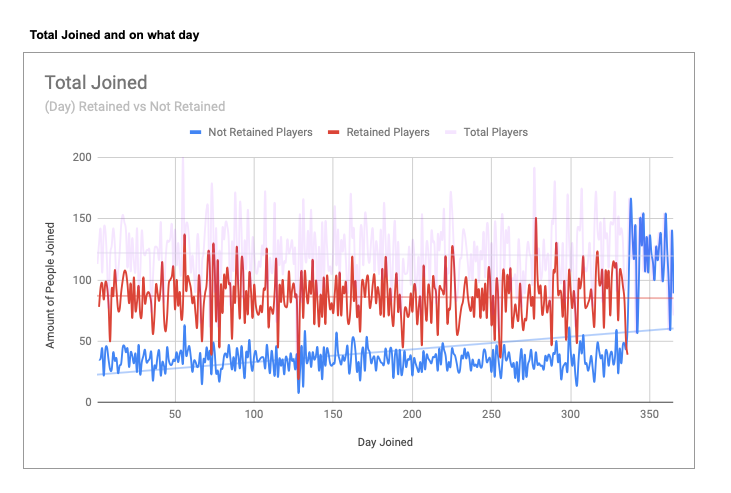
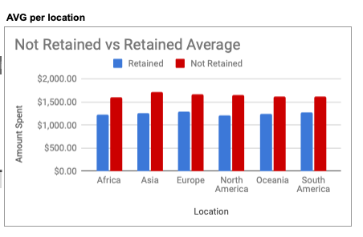
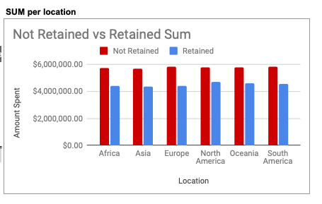
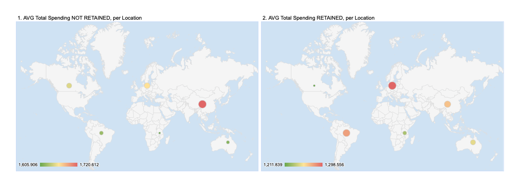

**30 DAY ANALYSIS, Player Retention, AUDRANA ESHO**

https://docs.google.com/spreadsheets/d/1x-uvfjh-6T0V1qPvSn7pXbKCoBJfHqx4gVZU3V2J_Cs/edit?usp=sharing

----

The data query exported allows us to see the; players_id, latest_match, joined_date, retention_day, age, total_spending.

With that data, I was able to create a new column in sheets (retention_day), where I was able to do =B2-C2. With that data, I was able to get a column where it details how many days played per player.

With that extra formula, I would be able to add a filter per chart either greater than 30 or less than 30.

Some of the questions we were able to answer with this date: The day in question, the number of players who joined that day, and of those who joined who were retained.

**1. THE DAY IN QUESTION & 2. THE TOTAL NUMBERS OF PLAYERS WHO JOINED THAT DAY**

Sheets page TOTAL PLAYED has a pivot table to total sum, not retained, and retained count of each day. We can see how many players joined on each day for each specific category. I also added TOTAL PLAYERS counta on the line chart, because I wanted to see the busiest day that a lot of people joined. (75th day of the year [175 players] which happens to be March 14, and 290th day of the year which happens to me September 4 [180 players]. Fun fact, both days match up to march break or labour day long weekend. 

**2. OF THE PLAYERS WHO JOINED, HOW MANY WERE RETAINED**

Sheets page TOTAL PLAYED has the grand total of each; total players, retained players, and not retained players. We can see a fraction of players are retained vs the un retained. 

With the previous questions answered, we can go in depth to analyze the spending and location metrics as well.

----

**DO PLAYERS WITH ROLLING 30 DAY RETENTION SPEND MORE**

If you head over to sheets page SPENDING PER LOCATION I have broken down the charts into 2 categories, AVERAGE per location and SUM per location. I also analyzed the total vs not retained vs retained.

We can see that the not retained on average spend more than the retained. 

But at looking at the total sum, we see that the not retained spend less in total. Which is a cool analysis when you relate it back to the total played category, the retained players are a fraction of the non retained.

As we can see, retained on average spend less, but in total spent more.

**DO PLAYERS WITH 30 DAY RETENTION COME FROM A SPECIFIC REGION**

If you take a look at SPENDING PER LOCATION, I also have an analysis of who spends the most per location on the maps added. Each map represents average total spending per location, one map is for not retained while the other is for retained.

From the first map1, we can see the not retained is most spent in Asia, while in map2, we can see the most spent is in Europe. 

With this data, we can analyze and see which location needs better promotions and in what region to get more people to purchase things through the online store.

----

**EXTRA ANALYSIS**

I also made another sheets titled AGE to analyze the age range of who plays the mosts. With this data we can change the game style or game type to attract a certain age as well. We can see that the average is 18-22 years old.

With this data you get a good visualization of who played on what day, who stayed to play after 30 days, how much they spent, where they are located and what age range they are from. We are able to use this data to change the game to either retain players or get them to spend more.

 
